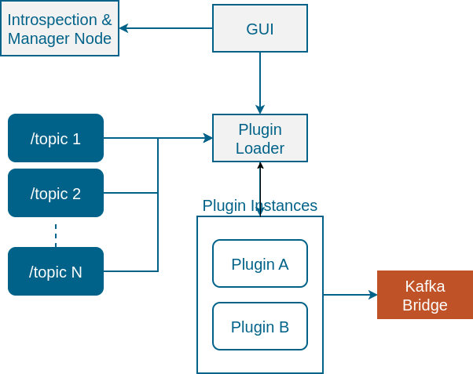

# ros2_kafka_dispatcher

`ros2_kafka_dispatcher` is a modular ROS 2 framework for collecting, processing and streaming robot data to Apache Kafka. The framework is designed for both research and production use, allowing dynamic discovery of ROS 2 topics, flexible plugin‑based processing pipelines and reliable publishing of data to Kafka.

## High-level architecture

The system consists of several cooperating ROS 2 nodes and libraries:

- Introspection & Manager Node - monitors the ROS 2 graph, discovers avaible topic names and message types at runtime, and reports dynamic changes.
- Plugin Loader - dynamically loads precessing plugins using the ROS 2 `pluginlib` library to manges their lifecycle.
- Processing Plugins - small libraries implementing specific data-processing algorithms ( for example a moving-average filter ). Each plugin subscribes to one or more topics, performs computations and publishes results to Kafka or new topics.
- Gui client - a graphical interface (RQT or standalone) that allows users to browse available topics, configure plugins and monitor their status
- Kafka Bridge - publishes raw or processed ROS 2 massages to Apache Kafka, with buffering and error handling.

## Repository structure

```
ros_ws/src/
  introspection_manager/   # rclcpp node exposing topic names & types
  plugin_loader/           # plugin loader library and management node
  plugin_interfaces/       # base interfaces for processing plugins
  processing_plugins/
    moving_average_filter/
    gps_velocity_estimator/
    ...
  gui_client/              # RQt/Qt GUI for topic and plugin management
  kafka_bridge/            # Kafka publisher node

```
Grouping plugins under processing_plugins keeps infrastructure packages separate from functional plugins. If a plugin needs independent versioning or unique dependencies, it can be placed in its own repository.

## Architecture diagram

Below is a high‑level architecture illustrating the data flow between components:


The Introspection & Manager node discovers ROS 2 topics and communicates with the GUI and plugin loader. The GUI sends configuration commands to the plugin loader. Selected topics are subscribed by the plugin loader, which instantiates plugin instances. Each plugin processes the data and publishes new topics or sends messages to the Kafka publisher.

## License

Apache 2.0
